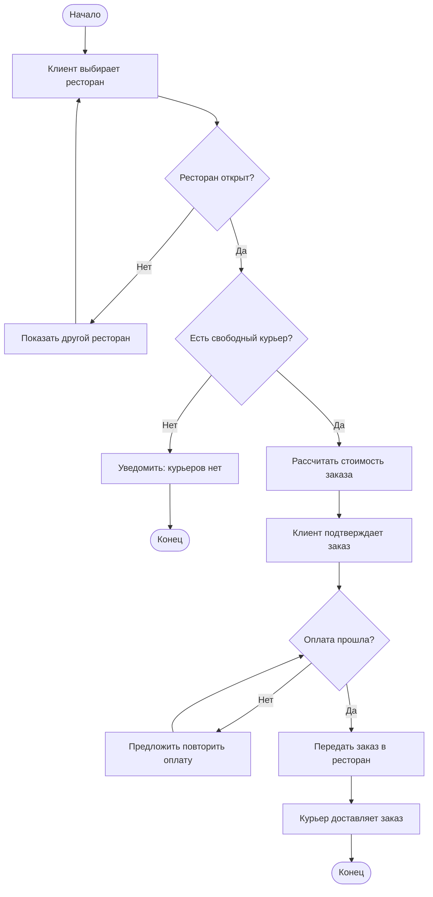

# Flowchart: Проверка возможности оформления заказа

```mermaid
flowchart TD
    A([Начало]) --> B[Клиент выбирает ресторан]
    B --> C{Ресторан открыт?}
    C -- Нет --> D[Показать другой ресторан]
    D --> B
    C -- Да --> E{Есть свободный курьер?}
    E -- Нет --> F[Уведомить: курьеров нет]
    F --> G([Конец])
    E -- Да --> H[Рассчитать стоимость заказа]
    H --> I[Клиент подтверждает заказ]
    I --> J{Оплата прошла?}
    J -- Нет --> K[Предложить повторить оплату]
    K --> J
    J -- Да --> L[Передать заказ в ресторан]
    L --> M[Курьер доставляет заказ]
    M --> N([Конец])
```