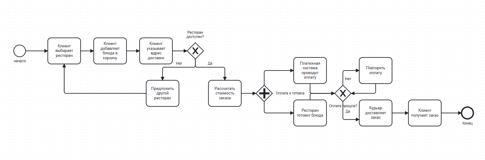
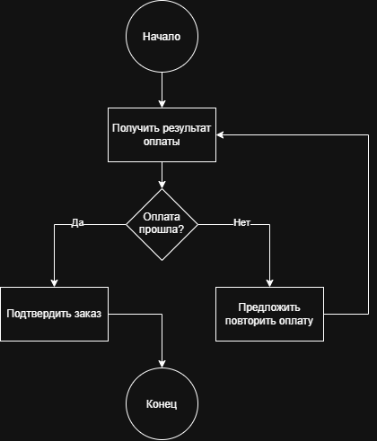
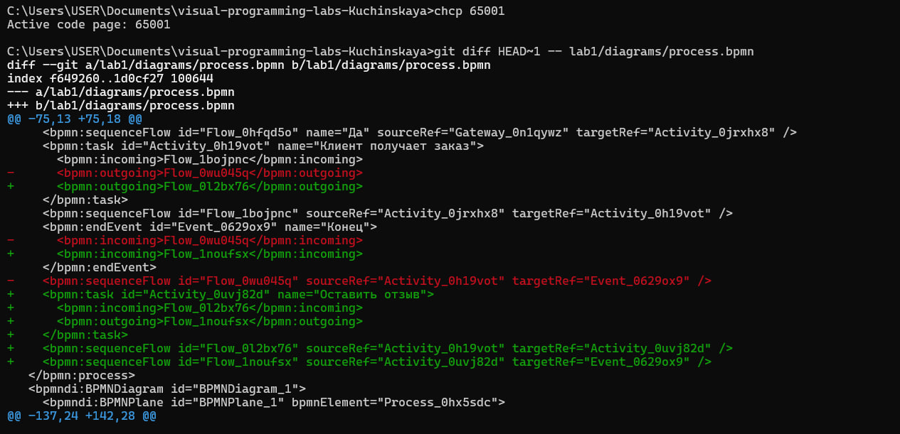
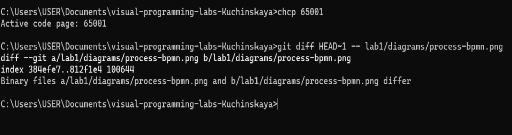

# Отчёт по лабораторной работе №1

**Тема:** Моделирование процессов с использованием Git и визуальных нотаций

**Студент:** Кучинская Екатерина

**Процесс:** Заказ еды с доставкой

---

## 1. Описание процесса

Разработан бизнес-процесс «Заказ еды с доставкой» через онлайн-сервис. Участники процесса: клиент, сервис доставки, ресторан, курьер и платёжная система. Процесс включает 12 шагов, два условия ветвления (проверка доступности ресторана и проверка оплаты) и одно параллельное действие (одновременная оплата заказа и приготовление блюд в ресторане). Полное описание находится в файле [docs/process\_description.md](docs/process_description.md).

---

## 2. Диаграммы

### 2.1. BPMN-диаграмма

Исходный файл: [diagrams/process.bpmn](diagrams/process.bpmn)

Диаграмма содержит:

- 1 стартовое событие

- 8 задач

- 3 шлюза (2 XOR + 1 AND)

- 1 конечное событие

### 2.2. UML Activity Diagram

Исходный файл: [diagrams/activity.drawio](diagrams/activity.drawio)

Диаграмма описывает шаг проверки оплаты и включает начальный узел, 3 действия, 1 решение (ромб) и конечный узел.

### 2.3. Sequence Diagram (Mermaid)

См. файл [docs/sequence.md](docs/sequence.md).

Описывает взаимодействие 5 участников: клиент, приложение, платёжная система, ресторан, курьер. Содержит 1 блок alt (ветвление).

### 2.4. Flowchart (Mermaid)

См. файл [docs/flowchart.md](docs/flowchart.md).

Блок-схема алгоритма проверки возможности оформления заказа.

---

## 3. Демонстрация diff: текстовый vs бинарный формат

### Diff для .bpmn (текстовый XML)

При изменении BPMN-файла Git показывает **конкретные строки XML**, которые изменились: удалённые (с -) и добавленные (с +). Видно, что добавилась задача «Оставить отзыв» и изменились стрелки.

### Diff для .png (бинарный)

Для PNG-файла Git показывает только сообщение Binary files differ без деталей. Это демонстрирует, что **бинарные форматы неудобны для версионирования**, в отличие от текстовых.

---

## 4. Выводы

В ходе лабораторной работы я освоила базовые команды Git: git clone, git add, git commit, git push, git diff, git log. Настроила SSH-ключ для работы с GitHub без ввода пароля.

Самым полезным было увидеть разницу между текстовыми и бинарными форматами при версионировании. Текстовые файлы (.bpmn, .drawio, .md) удобно сравнивать: Git показывает конкретные изменения. А бинарные (.png) — только факт «файлы отличаются», без деталей.

Также я научилась моделировать бизнес-процессы в четырёх нотациях: BPMN, UML Activity, Sequence и Flowchart. Это помогает посмотреть на один и тот же процесс с разных сторон: BPMN — для бизнеса, UML Activity — для алгоритма, Sequence — для взаимодействия систем, Flowchart — для логики.

